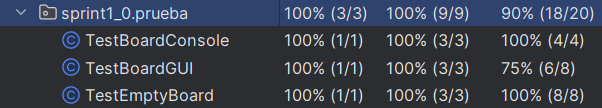
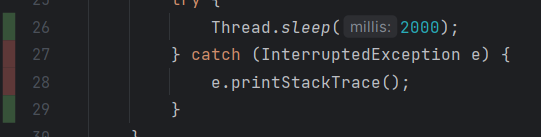
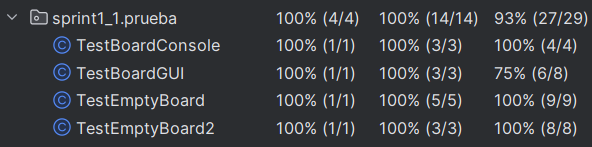
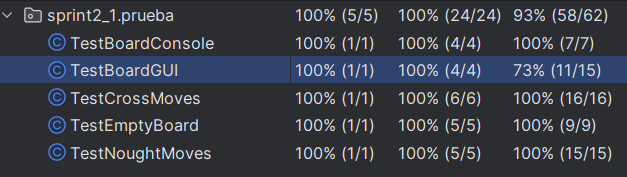

# ACTIVIDAD TIC-TAC-TOE
# Sprint 1

Considera la primera historia: como jugador, necesito un tablero vacío de 3 x 3 para comenzar un juego de TicTacToe.

### Escribimos el primer criterio de aceptación de la siguiente manera :

```
AC 1.1 Tablero vacío 
Cuando inicio un juego de TicTacToe
Entonces se crea un tablero vacío
Y de dimensión 3x3
```

Sin embargo aquí no se especifica completamente el requisito. ¿Se puede jugar el juego en un tablero más grande (por ejemplo, 5 x 5) usando una cuadrícula de 3 x 3?

### Agregamos dos criterios de aceptación sobre los límites del tablero

```
AC 1.2 Referencia de fila no válida
Dado un tablero 3x3
Cuando intento acceder a una fila mayor a 3
Entonces se me informa que está fuera del límite
```

```
AC 1.3 Referencia de columna no válida
Dado un tablero 3x3
Cuando intento acceder a una columna mayor a 3
Entonces se me informa que está fuera del límite
```
## Caracteristicas del sprint 1
### Pregunta: Explica el funcionamiento de los siguientes código dentro del sprint1.
```java
public class TestBoardConsole {
    //instancia un tablero
    private Board board;
    //Este método se va a ejecutar antes de los test
    @Before
    public void setUp() throws Exception {
   	 board = new Board();
    }
    //Este método se va a ejecutar después de los test
    @After
    public void tearDown() throws Exception {
    }
    //Este test comprueba si se muestra un tablero vacío en consola
    @Test
    public void testEmptyBoard() {
   	 new Console(board).displayBoard();
    }
}
```

```java
public class Console {
    private Board board;

    public Console(Board board) {
   	 this.board = board;
    }
    //Imprime un tablero 3x3 en consola
    public void displayBoard() {
   	 for (int row = 0; row<3; row++) {
   		 System.out.println("-------");
   		 System.out.print("|"+ board.getCell(row, 0));
   		 System.out.print("|"+ board.getCell(row, 1));
   		 System.out.print("|"+ board.getCell(row, 2));
   		 System.out.println("|");
   	 }
   	 System.out.println("-------");
    }
}
```

```java
//nos regresa un valor:
//-1 si es una casilla fuera de los límites
//el valor de la casilla si es una casilla válida
public int getCell(int row, int column){
       if(row >= 0 && row < 3 && column >= 0 && column < 3)
           return grid[row][column]; 
      else
           return -1
    }
```

### Pregunta: ¿se necesita refactorización?

```
Sí, pues no se especifica a qué hacen alusión los valores de retorno.
Usar una clase enum podría ayudarnos con esto
```

### Pregunta: Realiza la cobertura de código. Explica tus respuestas.

Para el codigo de sprint1_0:



En TestBoardGUI un 25% del test no está cubierto, luego de inspeccionar el código



Vemos que la captura de excepciones no se prueba en ningún test

Para el código de sprint1_1:



Observamos que se repite lo anterior, no se comprueba cuando hay una excepción al lanzar la GUI

# Sprint 2
```
AC 2.1 Un movimiento X válido 
Dado un juego en curso
Cuando el jugador X hace un movimiento en una celda vacía
Entonces la celda se llena con una X
Y pasa el turno al jugador O
```
```
AC 2.2 Un movimiento X ilegal en una celda ocupada
Dado un juego en curso
Cuando el jugador X hace un movimiento en una celda ocupada
Entonces no se cambia la celda
Y no se cambia el turno
```
```
AC 2.3 Un movimiento X ilegal fuera del tablero 
Dado un juego en curso 
Cuando  el jugador X hace un movimiento ilegal fuera del tablero
Entonces no se cambia la celda
Y no se cambia el turno
```
```
AC 3.1 Un movimiento O válido
Dado un juego en curso con el turno de O 
Cuando el jugador O hace un movimiento válido
Entonces se coloca O en la celda
Y el turno se cambia a X 
```
```
AC 3.2 Un movimiento O ilegal en una celda ocupada 
Dado un juego en curso con el turno de O 
Cuando el jugador O hace un movimiento ilegal dentro del tablero 
Entonces no se cambia la celda Y no se cambia el turno  
```
```
 AC 3.3 Un movimiento O ilegal fuera del tablero 
 Dado un juego en curso con el turno de O 
 Cuando el jugador O hace un movimiento ilegal fuera del tablero 
 Entonces la celda no se cambia.
```
### Después de la refactorización, continuamos midiendo la cobertura de código de Board y revisando los estilos de codificación.


```
Al igual que en los casos anteriores, solo no se toman en consideracion los casos de excepciones. Por lo demás, los tests están probando todos los métodos disponibles.
```
# Sprint 3
### Pregunta (V/F) La secuencia de cuatro movimientos, X (0,0), O (1,1), X (0,1), O (1,0) no cumple la necesidad.
```
F: No la cumple pues ni X ni O hacen un movimiento ganador (completar  OOO o XXX)
```

### Pregunta: Para hacer que testXWon pase, updateGameState se enfoca en los escenarios CROSS_WON. Indica al menos tres pruebas para AC4.1 para cubrir tres X seguidas de manera horizontal, vertical y diagonal.
```java
    @Test
    public void testXWonDiag() {
        board.makeMove(0, 0);
        board.makeMove(1, 0);
        board.makeMove(1, 1);
        board.makeMove(1, 2);
        board.makeMove(2, 2);
        assertEquals("", board.getGameState(), GameState.CROSS_WON);
        new GUI(board);
        try {
            Thread.sleep(2000);
        } catch (InterruptedException e) {
            e.printStackTrace();
        }
    }
    @Test
    public void testXWonRow1() {
        board.makeMove(1, 0);
        board.makeMove(0, 1);
        board.makeMove(1, 1);
        board.makeMove(0, 0);
        board.makeMove(1, 2);
        assertEquals("", board.getGameState(), GameState.CROSS_WON);
        new GUI(board);
        try {
            Thread.sleep(2000);
        } catch (InterruptedException e) {
            e.printStackTrace();
        }
    }
    @Test
    public void testXWonColumn0() {
        board.makeMove(0, 0);
        board.makeMove(2, 1);
        board.makeMove(0, 1);
        board.makeMove(1, 0);
        board.makeMove(0, 2);
        assertEquals("", board.getGameState(), GameState.CROSS_WON);
        new GUI(board);
        try {
            Thread.sleep(2000);
        } catch (InterruptedException e) {
            e.printStackTrace();
        }
    }
```
## Refactorización
### Pregunta ¿ Cuál es el problema de initialBoard y por que le cambiamos el nombre a resetGame.

```
El problema es que el nombre del método indica que solo debería funcionar cuando se inicia un nuevo tablero, pero en cambio, funciona para cada vez que se inicia un juego nuevo (reinicio).
Por lo que resulta conveniente cambiarlo de nombre a resetGame
```
# Evolución del Software
## Oponente por ordenador
```
AC 5.2 Una jugada ganadora de la computadora 
Dado que la computadora completa XXX
Cuando hace un movimiento X válido
Entonces se acaba la partida
Y se declara ganador a la computadora
```
```
AC 5.3 Una jugada de bloqueo de la computadora 
Dado un juego en curso
Cuando el jugador humano tiene OO
Entonces la computadora hace un movimiento X válido
Y completa OOX
Y se cambia de turno
```

### Pregunta: Verifica esto en el código del paquete del proyecto TicTacToe entregado.
AC 5.1
```java
private void makeFirstXMove() {
        Random random = new Random();
        int position = random.nextInt(9);
        super.makeMove(position/3, position%3);
    }
```
AC 5.2
```java
    private boolean makeWinningMove() {
        return false;
    }
```
AC 5.3
```java
    private boolean blockOpponentWinningMove() {
        return false;
    }
```
AC 5.4
```java
    private void makeRandomMove() {
        int numberOfEmptyCells = getNumberOfEmptyCells();
        Random random = new Random();
        int targetMove = random.nextInt(numberOfEmptyCells);
        int index=0;
        for (int row = 0; row < TOTALROWS; ++row) {
            for (int col = 0; col < TOTALCOLUMNS; ++col) {
                if (grid[row][col] == Cell.EMPTY) {
                    if (targetMove == index) {
                        super.makeMove(row, col);
                        return;
                    } else
                        index++;
                }
            }
        }
    }
```