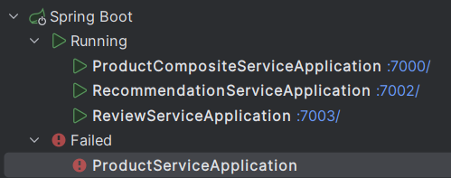
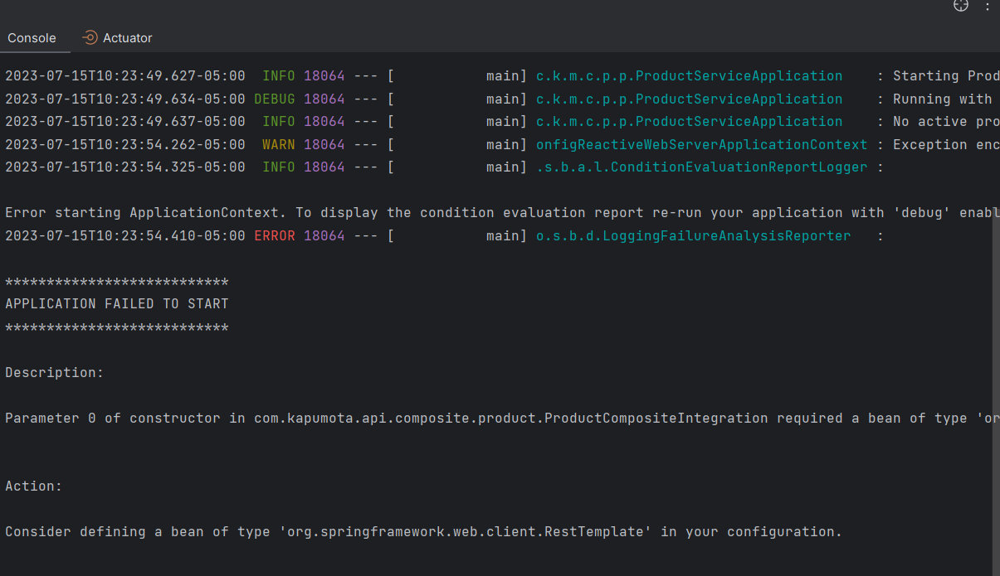
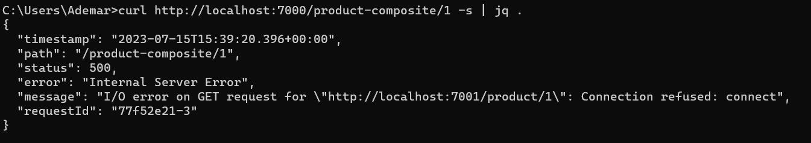

# Examen Final CC-3S2

Cada pregunta está dentro de su carpeta.

Los proyectos se han creado usando gradle en vscode, se ha hecho uso de jacoco para el codecoverage.

> No puse imágenes del desarrollo rojo verde del TDD, pero puedo asegurar que se hizo de esa forma.

## Pregunta 1

### Antes

> El código está tal cual, solo se ha revisado cómo funciona este primer approach
> 

### Fase 1

Pregunta:
Sigue la lógica comercial para un vuelo comercial y traduce eso escribiendo una prueba llamada AirportTest. ¿Cuáles son los resultados de las pruebas con cobertura obtenidas?
¿Puedes indicar algunas conclusiones de lo anterior, necesitamos refactorizar?

> Todos los test pasan, sin embargo, la cobertura es del 57% (con funcion main incluida) pues no se cubren las branchs cuando hay un tipo de vuelo no reconocido. En vez de usar switchs, se puede aplicar polimorfismo
> 

<aside>
 💡 Modificación de AirportTest.java para esta fase

</aside>

```java
package Fase1;

import static org.junit.jupiter.api.Assertions.assertAll;
import static org.junit.jupiter.api.Assertions.assertEquals;

import org.junit.jupiter.api.BeforeEach;
import org.junit.jupiter.api.DisplayName;
import org.junit.jupiter.api.Nested;
import org.junit.jupiter.api.Test;

public class AirportTest {

    @DisplayName("Hay un vuelo economico")
    @Nested
    class EconomyFlightTest {

        private Flight economyFlight;
        private Passenger checha;
        private Passenger lore;

        @BeforeEach
        void setUp() {
            economyFlight = new Flight("1", "Economica");
            checha = new Passenger("Checha", false);
            lore = new Passenger("Lore", true);
        }

        @Nested
        @DisplayName("Cuando tenemos un pasajero regular")
        class RegularPassenger {

            @Test
            @DisplayName("Luego puede agregarlo y eliminarlo de un vuelo economico")
            public void testEconomyFlightRegularPassenger() {
                assertAll("Verifica todas las condiciones para un pasajero regular y un vuelo economico",
                        () -> assertEquals("1", economyFlight.getId()),
                        () -> assertEquals(true, economyFlight.addPassenger(checha)),
                        () -> assertEquals(1, economyFlight.getPassengersList().size()),
                        () -> assertEquals("Checha", economyFlight.getPassengersList().get(0).getName()),
                        () -> assertEquals(true, economyFlight.removePassenger(checha)),
                        () -> assertEquals(0, economyFlight.getPassengersList().size())
                );
            }
        }

        @Nested
        @DisplayName("Cuando tenemos un pasajero VIP")
        class VipPassenger {
            @Test
            @DisplayName("Luego puedes agregarlo pero no puedes eliminarlo de un vuelo economico")
            public void testEconomyFlightVipPassenger() {
                assertAll("Verifica todas las condiciones para un pasajero VIP y un vuelo economico",
                        () -> assertEquals("1", economyFlight.getId()),
                        () -> assertEquals(true, economyFlight.addPassenger(lore)),
                        () -> assertEquals(1, economyFlight.getPassengersList().size()),
                        () -> assertEquals("Lore", economyFlight.getPassengersList().get(0).getName()),
                        () -> assertEquals(false, economyFlight.removePassenger(lore)),
                        () -> assertEquals(1, economyFlight.getPassengersList().size())
                );

            }
        }
    }

    @DisplayName("Dado que hay un vuelo de negocios")
    @Nested
    class BusinessFlightTest {
        private Flight businessFlight;
        private Passenger checha;
        private Passenger lore;

        @BeforeEach
        void setUp() {
            businessFlight = new Flight("2", "Negocios");
            checha = new Passenger("Checha", false);
            lore = new Passenger("Lore", true);
        }

        @Nested
        @DisplayName("Cuando tenemos un pasajero regular")
        class RegularPassenger {

            @Test
            @DisplayName("Entonces no puedes agregarlo o eliminarlo de un vuelo de negocios")
            public void testBusinessFlightRegularPassenger() {
                assertAll("Verifica todas las condiciones para un pasajero regular y un vuelo de negocios",
                        () -> assertEquals(false, businessFlight.addPassenger(checha)),
                        () -> assertEquals(0, businessFlight.getPassengersList().size()),
                        () -> assertEquals(false, businessFlight.removePassenger(checha)),
                        () -> assertEquals(0, businessFlight.getPassengersList().size())
                );
            }
        }

        @Nested
        @DisplayName("Cuando tenemos un pasajero VIP")
        class VipPassenger {

            @Test
            @DisplayName("Luego puedes agregarlo pero no puede eliminarlo de un vuelo de negocios")
            public void testBusinessFlightVipPassenger() {
                assertAll("Verifica todas las condiciones para un pasajero VIP y un vuelo de negocios",
                        () -> assertEquals(true, businessFlight.addPassenger(lore)),
                        () -> assertEquals(1, businessFlight.getPassengersList().size()),
                        () -> assertEquals(false, businessFlight.removePassenger(lore)),
                        () -> assertEquals(1, businessFlight.getPassengersList().size())
                );
            }
        }
    }
}
```

### Fase 2

Se hizo la refactorización pertinente para lograr que se respete el principio Open/Closed, se siguieron las instrucciones.

> **La refactorización y los cambios de la API se propagan a la implementación de las pruebas. ¿Cómo?**
> 

Sí, las pruebas debieron modificarse para que acepte este nuevo enfoque gracias a la refactorización. Se hace uso del polimorfismo

> **¿Cuál es el código de cobertura ahora? ¿Ayudó la refactorización a la mejor calidad de código?**
> 

Sin contar la clase main (pues no hay test para ella) la cobertura es del 100%, pero con dicha clase, la cobertura total es de 45%

La refactorización ayudó a que el código sea más entendible y a que se respeten los principios SOLID, sin embargo, para respetar el LSP sugiero mover los métodos abstractos a interfaces pues removePassenger solo lo debería implementar EconomyFlight, mas no BusinessFlight.

```java
public class BusinessFlight extends Flight{

    public BusinessFlight(String id) {
        super(id);
    }

    @Override
    public boolean addPassenger(Passenger passenger) {
        if (passenger.isVip()) { 
            return passengers.add(passenger);
        }
        return false;
    }

    @Override
    public boolean removePassenger(Passenger passenger) {
        return false;
    }
}
```

```java
public class EconomyFlight extends Flight{

    public EconomyFlight(String id) {
        super(id);
    }

    @Override
    public boolean addPassenger(Passenger passenger) {
        return passengers.add(passenger); 
    }

    @Override
    public boolean removePassenger(Passenger passenger) {
        if (!passenger.isVip()) { 
            return passengers.remove(passenger); 
        }
        return false;
    }

}
```

```java
import java.util.ArrayList; 
import java.util.Collections; 
import java.util.List; 

public abstract class Flight { 

    private String id; 
    protected List<Passenger> passengers = new ArrayList<Passenger>(); 

    public Flight(String id) { 
        this.id = id;
    }

    public String getId() { 
        return id; 
    } 

    public List<Passenger> getPassengersList() { 
        return Collections.unmodifiableList(passengers); 
    } 

    public abstract boolean addPassenger(Passenger passenger);

    public abstract boolean removePassenger(Passenger passenger); 
}
```

### Fase 3

Creé la clase PremiumFlight que sigue las directivas dadas.

> **Utiliza la clase AirportTest refactorizada antes de pasar al trabajo para el vuelo premium en el código desarrollado como mejora a tus resultados.**
> 

Con la clase agregada, pero sin modificar el AirportTest, el coverage obtenido es de 40% (incluyendo la clase main). Pero con el AirportTest actualizado se logra un 60% de cobertura junto a la clase main y sin contarla, es de 100%

<aside>
 💡 Había avanzado la implementación sin leer la fase 4

</aside>

### Fase 4

Como mencioné antes, esto ya lo hice en la Fase 3, dado que no hice uso de imágenes no puedo corroborar paso a paso que realicé TDD, sin embargo, si no fuese por el TDD hacer esa pregunta hubiese sido complicada de realizar.

```java
import static org.junit.jupiter.api.Assertions.assertAll;
import static org.junit.jupiter.api.Assertions.assertEquals;

import org.junit.jupiter.api.BeforeEach;
import org.junit.jupiter.api.DisplayName;
import org.junit.jupiter.api.Nested;
import org.junit.jupiter.api.Test;

public class AirportTest {

    @DisplayName("Hay un vuelo economico")
    @Nested
    class EconomyFlightTest {

        private Flight economyFlight;
        private Passenger checha;
        private Passenger lore;

        @BeforeEach
        void setUp() {
            economyFlight = new EconomyFlight("1");
            checha = new Passenger("Checha", false);
            lore = new Passenger("Lore", true);
        }

        @Nested
        @DisplayName("Cuando tenemos un pasajero regular")
        class RegularPassenger {

            @Test
            @DisplayName("Luego puede agregarlo y eliminarlo de un vuelo economico")
            public void testEconomyFlightRegularPassenger() {
                assertAll("Verifica todas las condiciones para un pasajero regular y un vuelo economico",
                        () -> assertEquals("1", economyFlight.getId()),
                        () -> assertEquals(true, economyFlight.addPassenger(checha)),
                        () -> assertEquals(1, economyFlight.getPassengersList().size()),
                        () -> assertEquals("Checha", economyFlight.getPassengersList().get(0).getName()),
                        () -> assertEquals(true, economyFlight.removePassenger(checha)),
                        () -> assertEquals(0, economyFlight.getPassengersList().size())
                );
            }
        }

        @Nested
        @DisplayName("Cuando tenemos un pasajero VIP")
        class VipPassenger {
            @Test
            @DisplayName("Luego puedes agregarlo pero no puedes eliminarlo de un vuelo economico")
            public void testEconomyFlightVipPassenger() {
                assertAll("Verifica todas las condiciones para un pasajero VIP y un vuelo economico",
                        () -> assertEquals("1", economyFlight.getId()),
                        () -> assertEquals(true, economyFlight.addPassenger(lore)),
                        () -> assertEquals(1, economyFlight.getPassengersList().size()),
                        () -> assertEquals("Lore", economyFlight.getPassengersList().get(0).getName()),
                        () -> assertEquals(false, economyFlight.removePassenger(lore)),
                        () -> assertEquals(1, economyFlight.getPassengersList().size())
                );

            }
        }
    }

    @DisplayName("Dado que hay un vuelo de negocios")
    @Nested
    class BusinessFlightTest {
        private Flight businessFlight;
        private Passenger checha;
        private Passenger lore;

        @BeforeEach
        void setUp() {
            businessFlight = new BusinessFlight("2");
            checha = new Passenger("Checha", false);
            lore = new Passenger("Lore", true);
        }

        @Nested
        @DisplayName("Cuando tenemos un pasajero regular")
        class RegularPassenger {

            @Test
            @DisplayName("Entonces no puedes agregarlo o eliminarlo de un vuelo de negocios")
            public void testBusinessFlightRegularPassenger() {
                assertAll("Verifica todas las condiciones para un pasajero regular y un vuelo de negocios",
                        () -> assertEquals(false, businessFlight.addPassenger(checha)),
                        () -> assertEquals(0, businessFlight.getPassengersList().size()),
                        () -> assertEquals(false, businessFlight.removePassenger(checha)),
                        () -> assertEquals(0, businessFlight.getPassengersList().size())
                );
            }
        }

        @Nested
        @DisplayName("Cuando tenemos un pasajero VIP")
        class VipPassenger {

            @Test
            @DisplayName("Luego puedes agregarlo pero no puede eliminarlo de un vuelo de negocios")
            public void testBusinessFlightVipPassenger() {
                assertAll("Verifica todas las condiciones para un pasajero VIP y un vuelo de negocios",
                        () -> assertEquals(true, businessFlight.addPassenger(lore)),
                        () -> assertEquals(1, businessFlight.getPassengersList().size()),
                        () -> assertEquals(false, businessFlight.removePassenger(lore)),
                        () -> assertEquals(1, businessFlight.getPassengersList().size())
                );
            }
        }
    }

    @DisplayName("Hay un vuelo Premium")
    @Nested
    class PremiumFlightTest{
        private Flight premiumFlight;
        private Passenger checha;
        private Passenger lore;

        @BeforeEach
        void setUp() {
            premiumFlight = new PremiumFlight("3");
            checha = new Passenger("Checha", false);
            lore = new Passenger("Lore", true);
        }

        @Nested
        @DisplayName("Cuando tenemos un pasajero regular")
        class RegularPassenger{
            @Test
            @DisplayName("Entonces no se puede agregar o eliminar de un vuelo premium")
            public void testPremiumFlightRegularPassenger() {
                assertAll("Verifica todas las condiciones para un pasajero regular y un vuelo Premium", 
                () -> assertEquals(false, premiumFlight.addPassenger(checha)),
                () -> assertEquals(0, premiumFlight.getPassengersList().size()),
                () -> assertEquals(false, premiumFlight.removePassenger(checha)),
                () -> assertEquals(0, premiumFlight.getPassengersList().size())
                );
            }
        }

        @Nested
        @DisplayName("Cuando tenemos un pasajero VIP")
        class VipPassenger {

            @Test
            @DisplayName("Luego puedes agregarlo y se puede eliminarlo de un vuelo Premium")
            public void testPremiumFlightVipPassenger() {
                assertAll("Verifica todas las condiciones para un pasajero VIP y un vuelo Premium",
                        () -> assertEquals(true, premiumFlight.addPassenger(lore)),
                        () -> assertEquals(1, premiumFlight.getPassengersList().size()),
                        () -> assertEquals(true, premiumFlight.removePassenger(lore)),
                        () -> assertEquals(0, premiumFlight.getPassengersList().size())
                );
            }
        }
    }
}
```

```java
public class PremiumFlight extends Flight{

    public PremiumFlight(String id) {
        super(id);
    }

    @Override
    public boolean addPassenger(Passenger passenger) {
        //solo se agrega si es VIP
        if(passenger.isVip())
            return passengers.add(passenger);
        return false;
    }

    @Override
    public boolean removePassenger(Passenger passenger) {
        //se puede remover a los pasajeros
        //Precondicion: todos los pasajeros de este vuelo son VIP
        return passengers.remove(passenger);
    }
    
}
```

### Fase 5

Acá opté por usar un hashmap en vez de un set, porque es mejor al momento de revisar si ya se encuentra dentro o no. Además, que así se puede acceder al objeto, cosa que en un set se tiene que hacer con un bucle for.

```java
import java.util.Collections;
import java.util.HashMap;
import java.util.Map;

public abstract class Flight { 

    private String id; 
    protected Map<String, Passenger> passengers = new HashMap<>(); 

    public Flight(String id) { 
        this.id = id;
    }

    public String getId() { 
        return id; 
    } 

    public Map<String, Passenger> getPassengersList() { 
        return Collections.unmodifiableMap(passengers); 
    } 

    public abstract boolean addPassenger(Passenger passenger);

    public abstract boolean removePassenger(Passenger passenger); 
}
```

```java
public class BusinessFlight extends Flight{

    public BusinessFlight(String id) {
        super(id);
    }

    @Override
    public boolean addPassenger(Passenger passenger) {
        if (passenger.isVip()) { 
            return passengers.putIfAbsent(passenger.getName(),passenger) == null;
        }
        return false;
    }

    @Override
    public boolean removePassenger(Passenger passenger) {
        return false;
    }
}
```

```java
public class EconomyFlight extends Flight{

    public EconomyFlight(String id) {
        super(id);
    }

    @Override
    public boolean addPassenger(Passenger passenger) {
        return passengers.putIfAbsent(passenger.getName(),passenger) == null;
    }

    @Override
    public boolean removePassenger(Passenger passenger) {
        if (!passenger.isVip()) { 
            return passengers.remove(passenger.getName()) != null;
        }
        return false;
    }

}
```

```java
public class PremiumFlight extends Flight{

    public PremiumFlight(String id) {
        super(id);
    }

    @Override
    public boolean addPassenger(Passenger passenger) {
        //solo se agrega si es VIP
        if(passenger.isVip())
            return passengers.putIfAbsent(passenger.getName(),passenger) == null;
        return false;
    }

    @Override
    public boolean removePassenger(Passenger passenger) {
        //se puede remover a los pasajeros
        //Precondicion: todos los pasajeros de este vuelo son VIP
        return passengers.remove(passenger.getName()) != null;
    }
    
}
```

```java
public class Airport { 

    public static void main(String[] args) { 
        Flight economyFlight = new EconomyFlight("1"); 
        Flight businessFlight = new BusinessFlight("2"); 

        Passenger checha = new Passenger("Checha", true); 
        Passenger lore = new Passenger("Lore", false); 

 
        businessFlight.addPassenger(checha); 
        businessFlight.removePassenger(checha); 
        businessFlight.addPassenger(lore); 
        economyFlight.addPassenger(lore); 

        System.out.println(" Lista de pasajeros de vuelos de negocios:"); 
        for (var entry : businessFlight.getPassengersList().entrySet()) { 
            System.out.println(entry.getValue().getName()); 
        } 

        System.out.println(" Lista de pasajeros de vuelos economicos:"); 
        for (var entry : economyFlight.getPassengersList().entrySet()) { 
            System.out.println(entry.getValue().getName()); 
        } 
    } 
}
```

## Pregunta 2

> Parte 1
> 

aquí está el pom.xml y es lo que sale en el navegador

```xml
<?xml version="1.0" encoding="UTF-8"?>
<project xmlns="http://maven.apache.org/POM/4.0.0"
         xmlns:xsi="http://www.w3.org/2001/XMLSchema-instance"
         xsi:schemaLocation="http://maven.apache.org/POM/4.0.0 http://maven.apache.org/xsd/maven-4.0.0.xsd">
    <modelVersion>4.0.0</modelVersion>

    <groupId>org.example</groupId>
    <artifactId>WebClient</artifactId>
    <version>1.0-SNAPSHOT</version>

    <properties>
        <maven.compiler.source>17</maven.compiler.source>
        <maven.compiler.target>17</maven.compiler.target>
        <project.build.sourceEncoding>UTF-8</project.build.sourceEncoding>
    </properties>
    <dependencies>
        <dependency>
            <groupId>org.mortbay.jetty</groupId>
            <artifactId>jetty</artifactId>
            <version>7.0.0.pre5</version>
        </dependency>
        <dependency>
            <groupId>org.junit.jupiter</groupId>
            <artifactId>junit-jupiter</artifactId>
            <version>RELEASE</version>
            <scope>test</scope>
        </dependency>
        <dependency>
            <groupId>org.junit.jupiter</groupId>
            <artifactId>junit-jupiter</artifactId>
            <version>RELEASE</version>
            <scope>test</scope>
        </dependency>
    </dependencies>

</project>
```


Para que funcione en mi pc tuve que cambiar el código de Jetty.java:

```java
public class Jetty {
    public static void main(String[] args) throws Exception {
        Server server = new Server(8081);

        Context root = new Context(server, "/");
        root.setResourceBase("C:\\Users\\Ademar\\OneDrive\\Desktop\\CC-3S2\\ExamenFinal-CC3S2\\Pregunta2\\WebClient\\pom.xml");
        root.setHandler(new ResourceHandler());

        server.setStopAtShutdown(true);
        server.start();
    }
}
```

pues con:

```java
root.setResourceBase("/pom.xml");
```

Obtenía error 404, y con:

```java
root.setResourceBase(".");
```

Obtenía error 403.

> Parte 2
> 

Implementamos:

```java
package org.example;

import java.io.IOException;
import java.io.OutputStream;

import javax.servlet.http.HttpServletRequest;
import javax.servlet.http.HttpServletResponse;

import org.mortbay.jetty.HttpHeaders;
import org.mortbay.jetty.Server;
import org.mortbay.jetty.handler.AbstractHandler;
import org.mortbay.jetty.servlet.Context;
import org.mortbay.util.ByteArrayISO8859Writer;

public class Jetty {
    public static void main(String[] args) throws Exception {
        Server server = new Server(8081);

        Context root = new Context(server, "/");
        root.setResourceBase("C:\\Users\\Ademar\\OneDrive\\Desktop\\CC-3S2\\ExamenFinal-CC3S2\\Pregunta2\\WebClient\\pom.xml");
        root.setHandler(new TestGetContentOkHandler());

        server.setStopAtShutdown(true);
        server.start();
    }

    private static class TestGetContentOkHandler extends AbstractHandler {
        public void handle(String target, HttpServletRequest request, HttpServletResponse response, int dispatch) throws IOException {
            OutputStream out = response.getOutputStream();
            ByteArrayISO8859Writer writer = new ByteArrayISO8859Writer ();
            writer.write("Esto funciona");
            writer.flush();
            response.setIntHeader(HttpHeaders.CONTENT_LENGTH, writer.size());
            writer.writeTo(out);
            out.flush();
        }
    }
}
```

> Parte 3
> 

Implementamos la prueba, en este caso utilicé la que está en la carpeta del examen, solo le quité la anotación que la deshabilitaba y el test pasa. 

<aside>
 💡 Pero solo pasa cuando tengo en ejecución Jetty.java

</aside>

```java
package org.example;

import java.net.MalformedURLException;
import java.net.URL;

import org.junit.jupiter.api.*;

import static org.junit.jupiter.api.Assertions.assertEquals;

public class TestWebClientInicial{

    @BeforeAll
    public static void setUp() {
    }

    @AfterAll
    public static void tearDown() {
        // Se detiene Jetty.
    }

    @Test
    //@Disabled(value = "Esto es un ejemplo de prueba inicial . Por tanto si se ejecuta no funciona.")
    public void testGetContentOk() throws MalformedURLException {
        WebClient client = new WebClient();
        String workingContent = client.getContent(new URL("http://localhost:8081/testGetContentOk"));

        assertEquals("Esto funciona", workingContent);
    }
}
```

> Parte 4
> 

En cuanto a los stubs: lo que se podría hacer es que en vez de esperar una conexión (en este caso, a localhost:8081), se utilice un stub para no requerir de una conexión para asegurarnos de que los métodos funcionan de forma correcta.

> Parte 5
> 

A base de alt+enter se pudo completar la clase estática StubHttpURLConnection, pues la desconocía totalmente. Gracias a TDD y un IDE como visualcode (también IntelliJ) se puede hacer eso.

```java
package org.example;

import java.io.ByteArrayInputStream;
import java.io.IOException;
import java.io.InputStream;
import java.net.HttpURLConnection;
import java.net.MalformedURLException;
import java.net.URL;
import java.net.URLConnection;
import java.net.URLStreamHandler;
import java.net.URLStreamHandlerFactory;

import org.junit.jupiter.api.*;

import static org.junit.jupiter.api.Assertions.assertEquals;

public class TestWebClientInicial{

    @BeforeAll
    public static void setUp() {
    }

    @AfterAll
    public static void tearDown() {
        // Se detiene Jetty.
    }

    @Test
    @Disabled(value = "Esto es un ejemplo de prueba inicial . Por tanto si se ejecuta no funciona.")
    public void testGetContentOk() throws MalformedURLException {
        WebClient client = new WebClient();
        String workingContent = client.getContent(new URL("http://localhost:8081/testGetContentOk"));

        assertEquals("Esto funciona", workingContent);
    }

    @Test
    public void testStubGetContentOk() throws MalformedURLException{
        URL.setURLStreamHandlerFactory(new StubStreamHandlerFactory());

        WebClient client = new WebClient();
        String result = client.getContent(new URL("http://example.com"));
        assertEquals("Esto funciona", result);
    }

    private static class StubStreamHandlerFactory implements URLStreamHandlerFactory {
        @Override
        public URLStreamHandler createURLStreamHandler(String protocol) {
            return new StubHttpURLStreamHandler();
        }
    }

    private static class StubHttpURLStreamHandler extends URLStreamHandler {
        @Override
        protected URLConnection openConnection(URL url) throws IOException {
            return new StubHttpURLConnection(url);
        }
    }

    private static class StubHttpURLConnection extends HttpURLConnection {
        public StubHttpURLConnection(URL url) {
            super(url);
        }

        @Override
        public InputStream getInputStream() throws IOException {
            return new ByteArrayInputStream("Esto funciona".getBytes());
        }

        @Override
        public void disconnect() {}

        @Override
        public boolean usingProxy() {
            return false;
        }

        @Override
        public void connect() throws IOException {}
    }
}
```

## Pregunta 4

> A partir de aquí se viene el declive en la calidad de mi escritura por la falta de tiempo
>

Después de seguir los pasos, y autocompletando con ayuda del IDE, creé las clases ProductCompositeIntegration, ProductCompositeServiceImpl y agregando los métodos pertinentes, obtuve todo el codigo fuente que está dentro de la carpeta

**Simular NotFoundException**:

```Java
@Override
    public ProductAggregate getProduct(int productId) {

        Product product = integration.getProduct(productId);
        if (product == null) {
            throw new NotFoundException("No se encontró el producto con id: " + productId);
        }
        List<Recommendation> recommendations = integration.getRecommendations(productId);
        List<Review> reviews = integration.getReviews(productId);

        return createProductAggregate(product, recommendations,
                reviews, serviceUtil.getServiceAddress());
    }
```

Aquí se encuentra el código de cómo se implementa...

Se supone que debería mostrar cómo se ejecuta pero hay un pequeño problema con eso

Debería poderse ejecutar el servicio Product, pero por alguna razón no lo hace. Me recomienda poner un Bean de RestTemplate, pero eso ya lo hice siguiendo los pasos del ejercicio



**El cliente API** Este servicio compuesto une a todos los microservicios para poder agregar un producto, tanto sus reseñas como el producto en sí y las recomendaciones. Es por ello que es necesario tener todos los microservicios corriendo para poder hacer uso de ese servicio que los integra..

**Manejo de errores en recommendations y reviews** 
A diferencia de lo que hice con Product, debería hacer un try catch pues no es necesario tener reviews o recomendaciones del producto para poder acceder a él, sin embargo para que esto ocurra debo terminar las implementaciones en sus microservicios correspondientes.

**Proceso de validación de integración**

Como ya mencioné, hubo un error, por lo que la conexión a producto se me deniega y no puedo conectarme



Gracias a lo que se muestra en la imagen, cuando busco el curl, lo que obtengo es esto



## Pregunta 3

<aside>
 🛑Alerta de excusa
<aside>

Dado el quebradero de cabeza que fue intentar arreglar el problema anterior de la pregunta 4, sumado a que mi ultimo examen final (sin contar este) acabó ~~conmigo~~ ayer a las 9pm, no me ha dado tiempo de empezar la pregunta 3.