# Pregunta 2
El codigo que uso de base es del Proyecto TicTactoe, en específico del sprintX_autoplay
# Requisito 1: Colocación de piezas
## Fuera de Limite I
Aún no se implementa el método jugar()
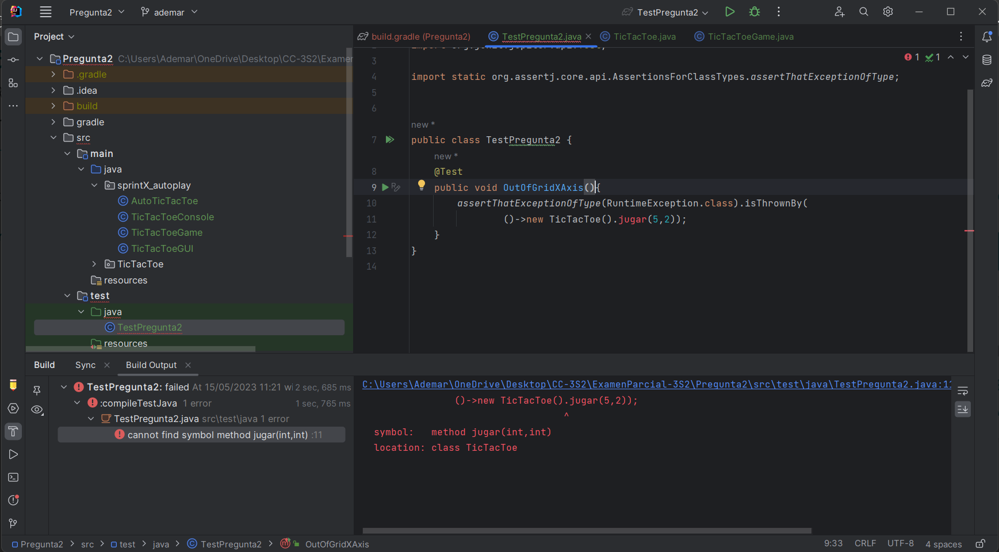
Se implementa el método jugar pero no tiene nada
```Java
public void jugar(int x, int y) {

}
```
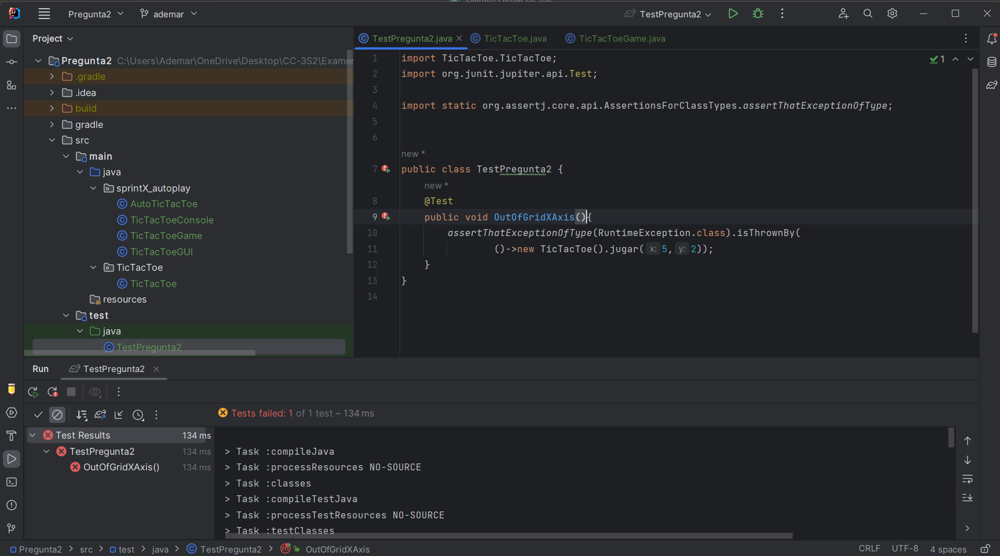
Se implementa el lanzamiento de excepción cuando se está fuera de los límites del eje X
```Java
public void jugar(int x, int y) {
        if (x >= 1 && x <= TOTALROWS ){
            return;
        }
        else{
            throw new RuntimeException();
        }
    }
```
Se vuelve a ejecutar el test con estos cambios
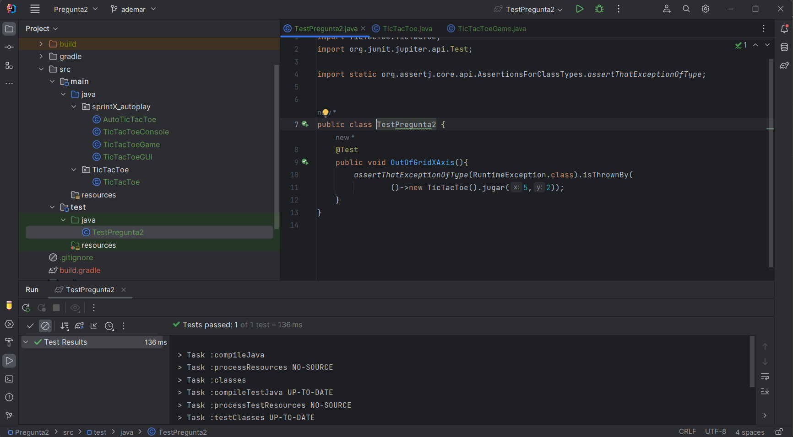
## Fuera de Limite II
El método jugar no contempla excepciones fuera del eje Y
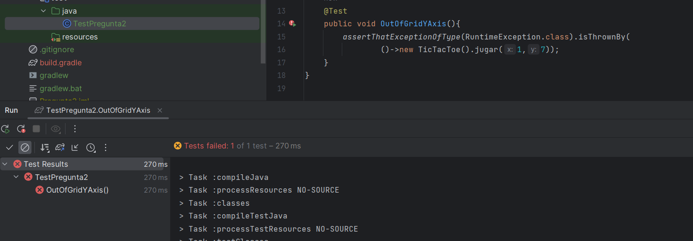
Se añade la comprobacion del eje Y
```Java
public void jugar(int x, int y) {
        if (x >= 1 && x <= TOTALROWS && y >= 1 && y <= TOTALCOLUMNS){
            return;
        }
        else{
            throw new RuntimeException();
        }
    }
```
Corremos el test de nuevo, y ahora pasa
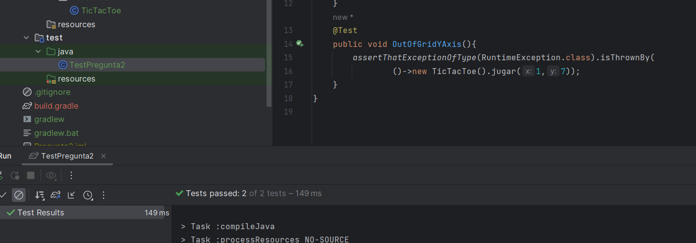

## Refact Fuera de Limite I y II
dado que implemente las variables estáticas `TOTALROWS` y `TOTALCOLUMNS` desde el inicio, una refactorización que se puede hacer aquí es la de cambiar ese if, si se cumple en vez de retornar, que lance la excepción. 

Acá se explica mejor:
```Java
public void jugar(int x, int y) {
        if (x < 1 || x> TOTALROWS || y < 1 || y>TOTALCOLUMNS){
            throw new RuntimeException();
        }
        /*
        else{
            //acá iría el metódo en el que pone la ficha en la grid
        }

         */
    }
```
Los test siguen pasando
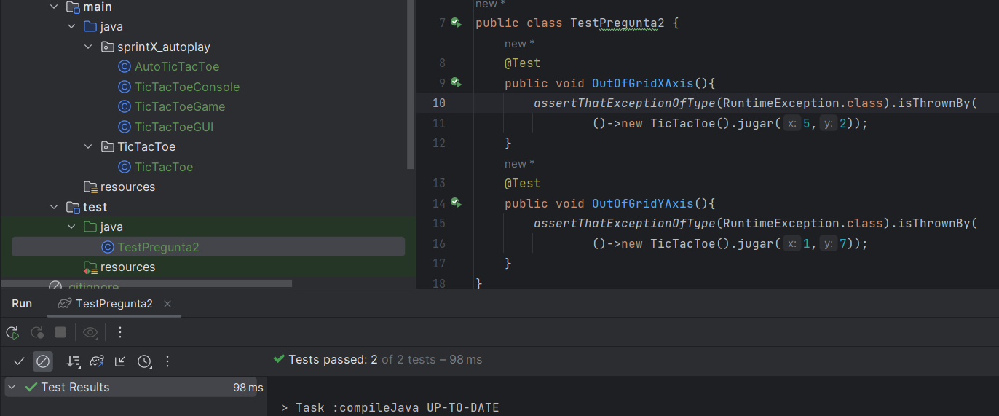


A partir de esta prueba, es preciso cambiar algunas cosas.
Como los nombres de algunas variables, agregar la Grid del tablero, los getters del turno y elemento del grid, y además la implementación de los turnos.

A continuación, el código actualizado
```Java
public class TicTacToe {
    private final int TOTALROWS = 3;
    private final int TOTALCOLUMNS = 3;
    public enum Cell {
        EMPTY, CROSS, NOUGHT
    }
    protected Cell[][] grid;
    public TicTacToe() {
        grid = new Cell[TOTALROWS][TOTALCOLUMNS];
        initBoard();
    }
    private void initBoard() {
        for (int row = 0; row < TOTALROWS; ++row) {
            for (int col = 0; col < TOTALCOLUMNS; ++col) {
                grid[row][col] = Cell.EMPTY;
            }
        }
    }
    public Cell getCell(int row, int column) {
        if (row >= 1 && row <= TOTALROWS && column >= 1 && column <= TOTALCOLUMNS) {
            return grid[row-1][column-1];
        } else {
            return null;
        }
    }
    public void jugar(int row, int col) {
        //si está fuera de los límites, lanza excepción
        if (row < 1 || row> TOTALROWS || col < 1 || col >TOTALCOLUMNS){
            throw new RuntimeException();
        }
    }
}
```
Volvemos a correr los test para asegurarnos de que nuestras implementaciones no han roto algo
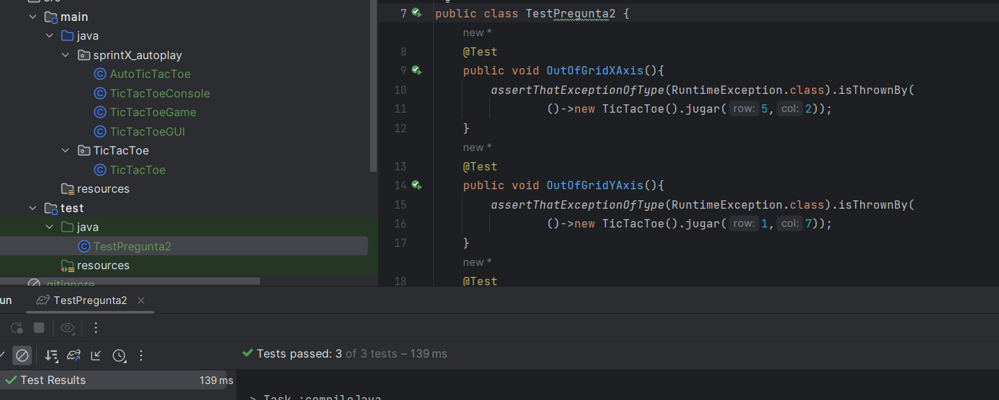
## Lugar Ocupado
Al no estar implementada la asignación de fichas en la grid, este teste debe fallar
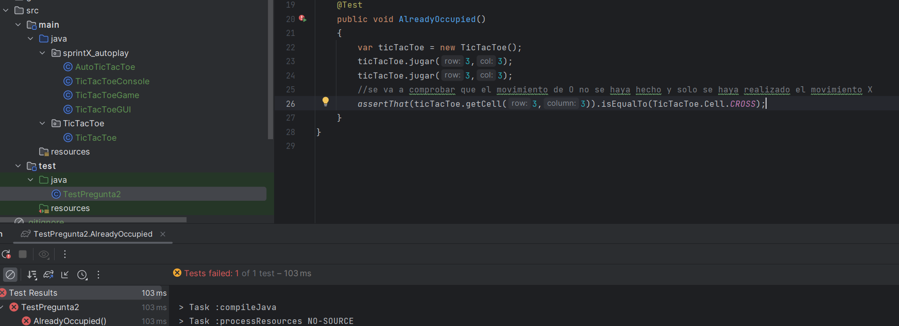
Luego, al implementarlo, además poniendo las condiciones para que no se sobreescriban movimientos:
```Java
public void jugar(int row, int col) {
        //si está fuera de los límites, lanza excepción
        if (row < 1 || row> TOTALROWS || col < 1 || col >TOTALCOLUMNS){
            throw new RuntimeException();
        }
        //si está ocupada, regresa
        else if(grid[row-1][col-1] != Cell.EMPTY){
            return;
        }
        //Hace el movimiento si la celda no está ocupada
        else{
            grid[row-1][col-1] = Cell.CROSS;
        }
    }
```
Corremos los test:
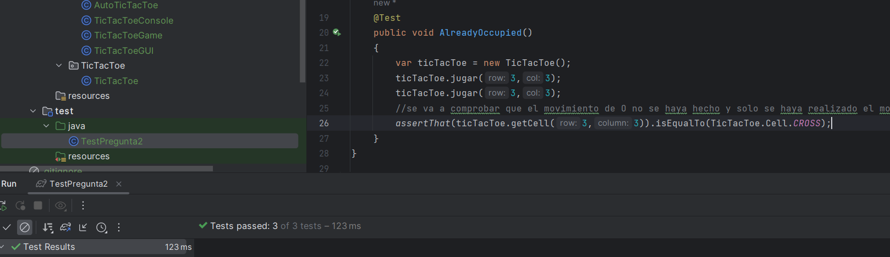

## Refactorización :D
Hacer SRP a jugar. comprobar Invalido ahora se encarga de fuera de limites y jugar de hacer movimientos luego de comprobar si no están fuera de límites
```Java
    public void comprobarInvalido(int row, int col){
        //si está fuera de los límites, lanza excepción
        if (row < 1 || row> TOTALROWS || col < 1 || col >TOTALCOLUMNS){
            throw new RuntimeException();
        }
    }
    public void jugar(int row, int col) {
        comprobarInvalido(row,col); //si es un movimiento invalido lanza una excepción
        //si está vacía, rellena
        if(grid[row-1][col-1] == Cell.EMPTY){
            grid[row-1][col-1] =  Cell.CROSS;
        }
        //si esta ocupada, no hace nada
    }
```

# Requisito 2: Agregar soporte para dos jugadores
## X juega primero
En efecto, falla
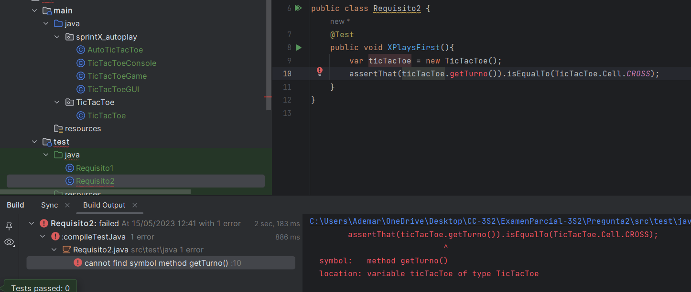

```Java
protected char turn;
public char getTurno() {
    return turn;
}
private void initBoard() {
    for (int row = 0; row < TOTALROWS; ++row) {
        for (int col = 0; col < TOTALCOLUMNS; ++col) {
            grid[row][col] = Cell.EMPTY;
        }
    }
    //el turno empieza en X
    turn = 'X';
}
```
Después de modificar además el valor esperado ('X' en vez de Cell.Cross).
Ahora sí pasa el test
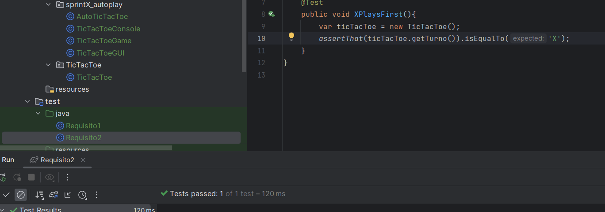
## O juega justo después de X

Es aquí donde debemos agregar el cambio de turno después de realizar un movimiento
```Java
public void jugar(int row, int col) {
    comprobarInvalido(row,col); //si es un movimiento invalido lanza una excepción
    //si está vacía, rellena
    if(grid[row-1][col-1] == Cell.EMPTY){
        grid[row-1][col-1] =  (turn == 'X') ? Cell.CROSS : Cell.NOUGHT;;
        turn = (turn == 'X') ? 'O' : 'X';
    }
    //si esta ocupada, no hace nada
}
```
Ahora pasará el test:
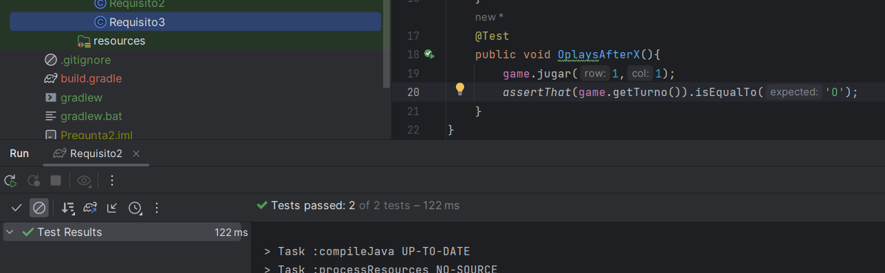

# Requisito 3: Agregar condiciones ganadoras
## No hay condicion ganadora
Aún no está implementado el método hayGanador
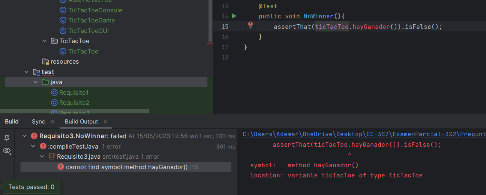
Primera implemetación
```Java
public boolean hayGanador() {
    return false;
}
```
Ejecutamos el test y este pasa, porque retorna False, que es lo que esperamos
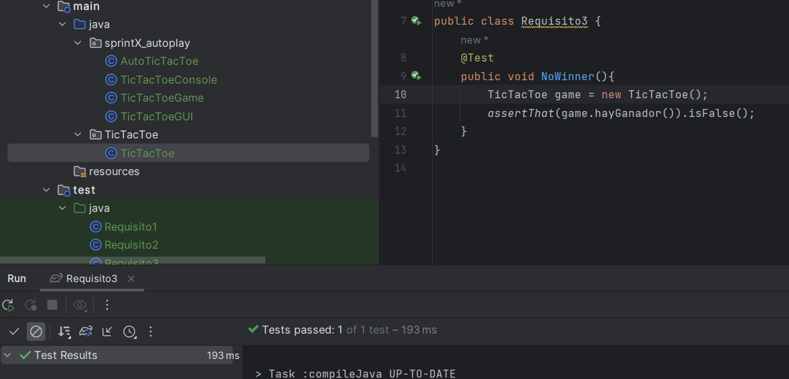
## Condicion Ganadora I
La prueba va a fallar porque aún no se modifica el método
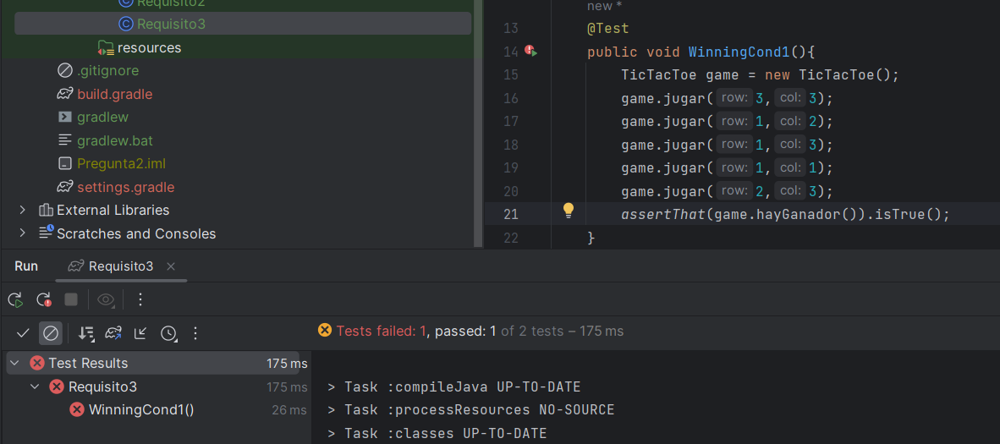
Ahora implementamos que se pueda ganar de forma horizontal:
```Java
public boolean hayGanador() {
    for(int i=0;i<TOTALROWS;i++){
        //se fija si la primer ficha de la fila tiene coincidencia en toda la fila
        if(grid[0][i] != Cell.EMPTY && 
            grid[1][i] == grid[0][i] && 
            grid[2][i] == grid[0][i]){
            return true;
        }
    }
    return false;
}
```
Y pasa el test:
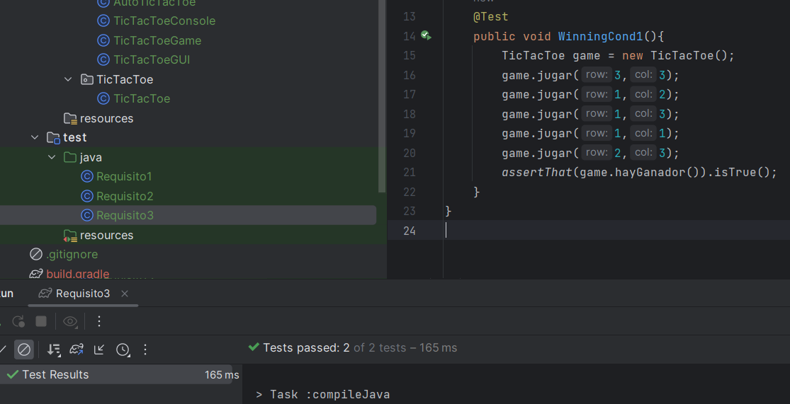
## Refactorización
Hacemos que cada forma de ganar ie:horizontal, vertical o diagonal,tenga su propio método. Empezamos por horizontal:
```Java
public boolean puntoHorizontal(){
    for(int i=0;i<TOTALROWS;i++){
        //se fija si la primer ficha de la fila tiene coincidencia en toda la fila
        if(grid[0][i] != Cell.EMPTY &&
                grid[1][i] == grid[0][i] &&
                grid[2][i] == grid[0][i]){
            return true;
        }
    }
    return false;
}
public boolean hayGanador() {
    return puntoHorizontal();
}
```
Los test siguen pasando :D
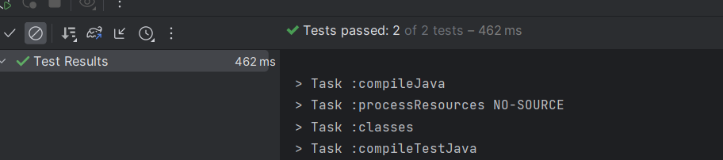
## Condición ganadora II
El test no va a pasar:
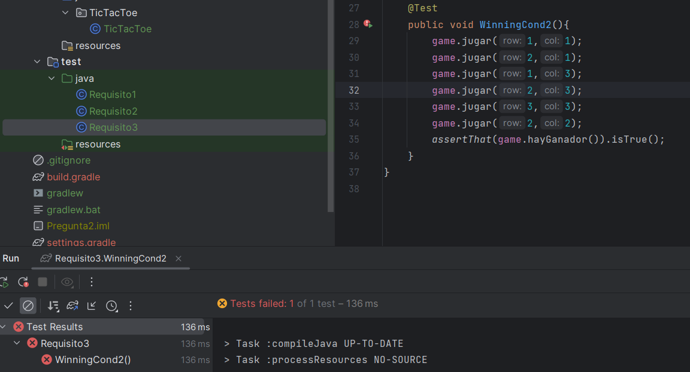
Lo implementamos de forma análoga a puntoHorizontal
```Java
public boolean puntoVertical(){
    for(int i=0;i<TOTALCOLUMNS;i++){
        //se fija si la primer ficha de la columna tiene coincidencia en toda la columna
        if(grid[i][0] != Cell.EMPTY &&
                grid[i][1] == grid[i][0] &&
                grid[i][2] == grid[i][0]){
            return true;
        }
    }
    return false;
    }
public boolean hayGanador() {
    return puntoHorizontal() || puntoVertical();
} 
```
Ahora sí pasa el test
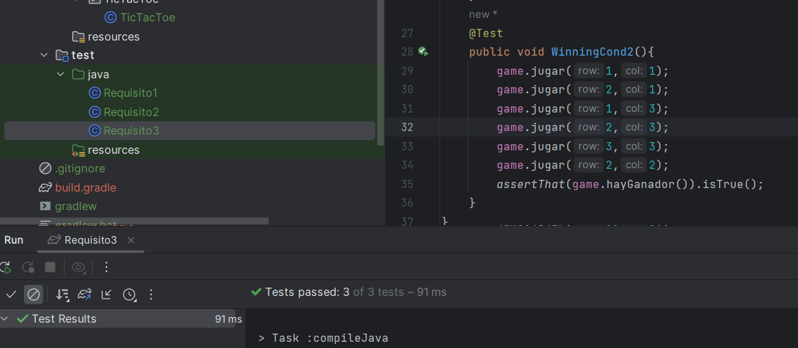
## Condicion Ganadora III
Ya se la saben amiwitos, ahora veremos de forma análoga la implementación de la validación de puntos de la diagonal desde la parte superior izquierda hasta la inferior derecha.

Y aquí vemos cómo falla porque no está implementado
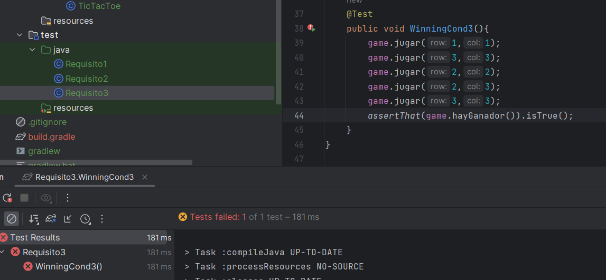
Ahora lo implementamos:
```Java
public boolean puntoDiagIzq(){
    return grid[0][0] != Cell.EMPTY &&
            grid[0][0] == grid[1][1] &&
            grid[0][0] == grid[2][2];
}
public boolean hayGanador() {
    return puntoHorizontal() || puntoVertical() || puntoDiagIzq();
}
```
Pasamos los test:
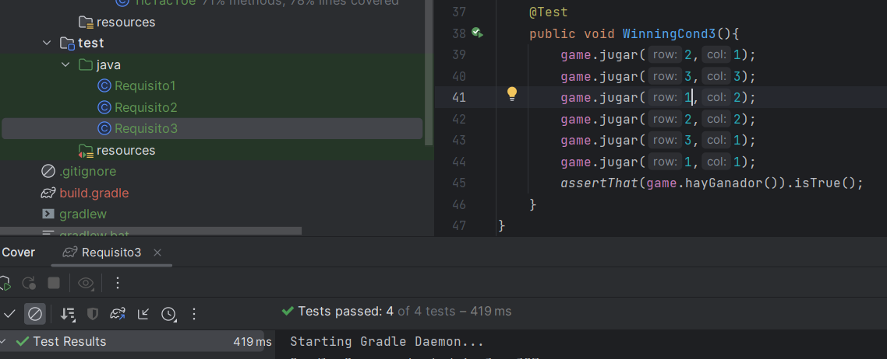

`Todo perfecto no? Pues sí es observador se dará cuenta que las pruebas discrepan en los movimientos, esto fue un error mío pues en la primer prueba que corrí de WinningCond3 no hacía movimiento de diagonal para O como quise en un inicio. De igual forma el test iba a fallar, y sí, debería volver a hacer el test con la modificación antes de la correcta implemetación para que falle pero ya llevo 4 horas en esto, tenga piedad. por favor.`

## Condicion Ganadora IV
Falla :D
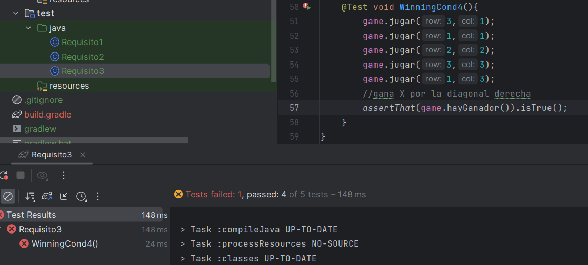
Implementamos código:
```Java
public boolean puntoDiagDer(){
    return grid[1][1] != Cell.EMPTY &&
            grid[0][2] == grid[1][1] &&
            grid[2][0] == grid[1][1];
}
public boolean hayGanador() {
    return puntoHorizontal() ||
            puntoVertical() ||
            puntoDiagIzq() ||
            puntoDiagDer();
}
```
Ahora pasa el test :D
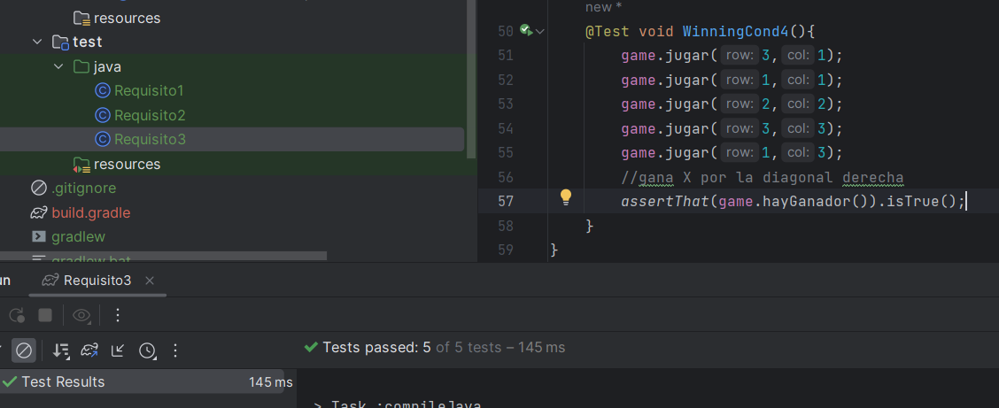

## Refact
Usando bucles:
```Java
public boolean puntoDiagIzq(){
        Cell aux = grid[1][1];
        if(aux==Cell.EMPTY) {
            return false;
        }
        boolean auxb = true;
        for(int i=0;i<TOTALROWS;i++){
            if(aux != grid[i][i]){
                auxb = false;
                break;
            }
        }
        return auxb;
    }
    public boolean puntoDiagDer(){
        Cell aux = grid[1][1];
        if(aux==Cell.EMPTY) {
            return false;
        }
        boolean auxb = true;
        for(int i=0;i<TOTALROWS;i++){
            if (aux != grid[i][2 - i]) {
                auxb = false;
                break;
            }
        }
        return auxb;
    }
```
Los test pasan:
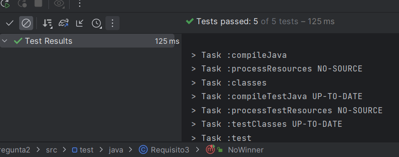
# Ups...
Pues resulta que la clase esGanador que viene después de Requisito 4 es parte de la refactorización, pero yo ya había implementado las pruebas con hayGanador.

Modifiqué los asserts para que usen cada método por separado y los test siguen saliendo verdes :D
```Java
public class Requisito3 {
    private TicTacToe game;
    @BeforeEach
    public void setUp(){
        game = new TicTacToe();
    }
    @Test
    public void NoWinner(){
        assertThat(game.hayGanador()).isFalse();
    }
    @Test
    public void WinningCond1(){
        game.jugar(3,3);
        game.jugar(1,2);
        game.jugar(1,3);
        game.jugar(1,1);
        game.jugar(2,3);
        //gana X en la fila 3
        assertThat(game.puntoHorizontal()).isTrue();
    }
    @Test
    public void WinningCond2(){
        game.jugar(1,1);
        game.jugar(2,1);
        game.jugar(1,3);
        game.jugar(2,3);
        game.jugar(3,3);
        game.jugar(2,2);
        //gana O en la columna 2
        assertThat(game.puntoVertical()).isTrue();
    }
    @Test
    public void WinningCond3(){
        game.jugar(2,1);
        game.jugar(3,3);
        game.jugar(1,2);
        game.jugar(2,2);
        game.jugar(3,1);
        game.jugar(1,1);
        //gana O por la diagonal izq
        assertThat(game.puntoDiagIzq()).isTrue();
    }
    @Test void WinningCond4(){
        game.jugar(3,1);
        game.jugar(1,1);
        game.jugar(2,2);
        game.jugar(3,3);
        game.jugar(1,3);
        //gana X por la diagonal derecha
        assertThat(game.puntoDiagDer()).isTrue();
    }
}
```
Corrí todos los test hasta ahora y dieron verde!
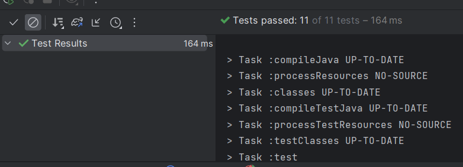
# Requisito 4: Condiciones de empate
## Manejo de una situación de empate
Implementando un método tableroLleno():
```Java
public boolean tableroLleno(){
    for(int i=0;i<TOTALROWS;i++){
        for(int j=0;j<TOTALCOLUMNS;j++){
            if(grid[i][j] == Cell.EMPTY){
                return false;
            }
        }
    }
    return true;
}
```
El test pasa
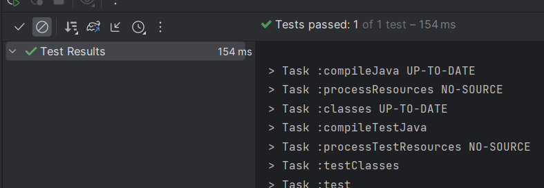
## Refact
Falla :D
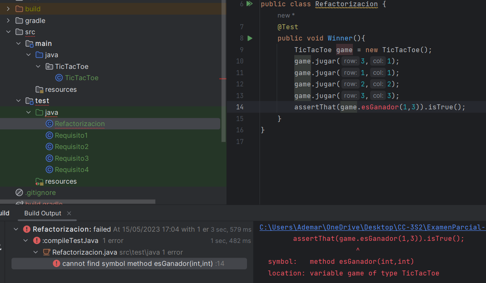
Implementamos el método:
```Java
    public boolean esGanador(char turn,int row1, int col1) {
        int row = row1-1;
        int col = col1-1;
        Cell token = (turn == 'X') ? Cell.CROSS : Cell.NOUGHT;
        return (grid[row][0] == token
                && grid[row][1] == token && grid[row][2] == token
                || grid[0][col] == token
                && grid[1][col] == token && grid[2][col] == token
                || row == col
                && grid[0][0] == token && grid[1][1] == token && grid[2][2] == token
                || row + col == 2
                && grid[0][2] == token && grid[1][1] == token && grid[2][0] == token);
    }
```
Corremos todos los test para finalizar
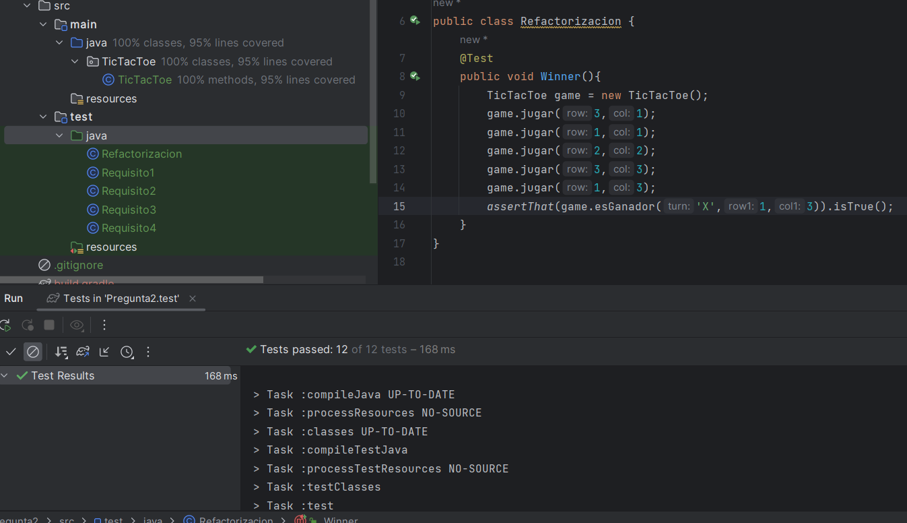

# Coverage con JaCoCO

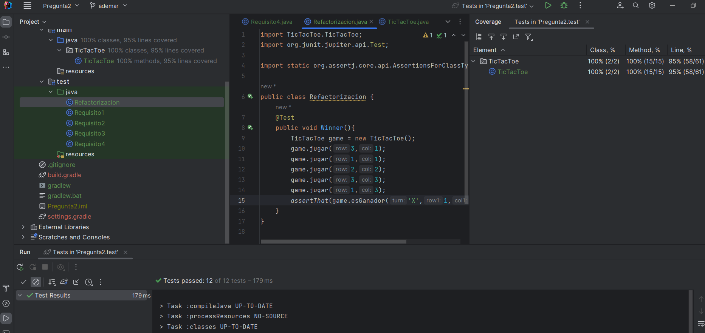
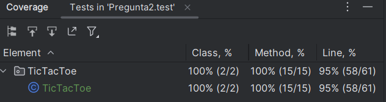