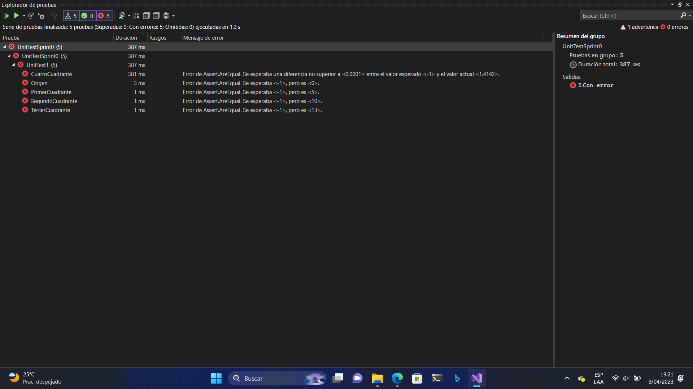
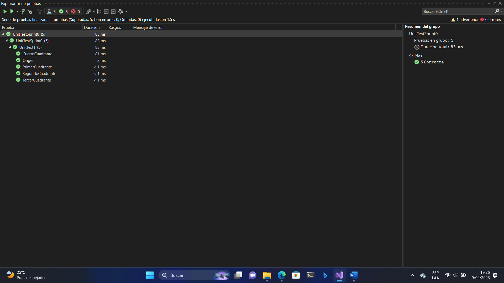
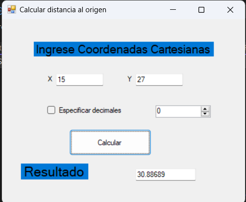
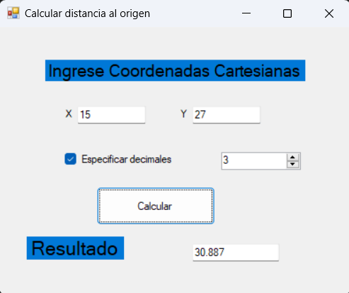

# Sprint 0

## 1. Decisiones claves para el proyecto SOS 
| Necesidad | Decision |
| -------- | -------- |
| Lenguaje de programación orientado a objetos | C# |
|Librería GUI  (recomendable) |	Windows Forms |
| IDE (Integrated Development Environment) |	Visual Studio Community 2022 |
| Framework  xUnit (JUnit for Java por ejemplo)	| MsTest (.NET Framework) |
| Guía de estilo de programación (debe ser leído con cuidado) |	Guía de estilo de C# Microsoft (Convensiones) |
| Sitio de alojamiento del proyecto | https://github.com/NaoDekoNeko/CC-3S2 |
| Otras decisiones si procede | |	

> Guía de estilo de C# Microsoft (Convenciones de código de C#): https://learn.microsoft.com/es-es/dotnet/csharp/fundamentals/coding-style/coding-conventions

## 2. Pruebas unitarias
### Codigo de los Tests
#### UnitTest1.cs
```C#
using Microsoft.VisualStudio.TestTools.UnitTesting;
using System;
using Sprint0;

namespace UnitTestSprint0
{
    [TestClass]
    public class UnitTest1
    {
        [TestMethod]
        public void Origen()
        {
                var distancia = new Distancia();
                var punto = new Coordenada(0, 0);
                var resultado = distancia.CalcularDistancia(punto);
                Assert.AreEqual(resultado, 0.0);
            
        }
        [TestMethod]
        public void PrimerCuadrante()
        {
            var distancia = new Distancia();
            var punto = new Coordenada(3, 4);
            var resultado = distancia.CalcularDistancia(punto);
            Assert.AreEqual(resultado, 5.0);
        }

        [TestMethod]
        public void SegundoCuadrante()
        {
            var distancia = new Distancia();
            var punto = new Coordenada(-6, 8);
            var resultado = distancia.CalcularDistancia(punto);
            Assert.AreEqual(resultado, 10.0);
        }

        [TestMethod]
        public void TercerCuadrante()
        {
            var distancia = new Distancia();
            var punto = new Coordenada(-12, -5);
            var resultado = distancia.CalcularDistancia(punto);
            Assert.AreEqual(resultado, 13.0);
        }

        [TestMethod]
        public void CuartoCuadrante()
        {
            var distancia = new Distancia();
            var punto = new Coordenada(1, -1);
            var resultado = distancia.CalcularDistancia(punto);
            Assert.AreEqual(resultado, 1.4142, 0.0001);
        }
    }
}
```
### Test en rojo
```C#
#### Distancia.cs
namespace Sprint0
{
    public class Distancia    {
        // Función que calcula la distancia de un punto al Origen
        public double CalcularDistancia(Coordenada punto)
        {
            return -1;

        }
    }
}
```


### Test en verde
#### Distancia.cs
```C#
namespace Sprint0
{
    public class Distancia    {
        // Función que calcula la distancia de un punto al Origen
        public double CalcularDistancia(Coordenada punto)
        {
            return Math.Sqrt(Math.Pow(punto.getX(), 2) + Math.Pow(punto.getY(), 2));

        }
    }
}
```


## 3. Programación
### GUI sin especificar decimales

### GUI con 3 decimales

### Código fuente
#### Form1.cs
```C#
using System;
using System.Collections.Generic;
using System.ComponentModel;
using System.Data;
using System.Drawing;
using System.Linq;
using System.Text;
using System.Threading.Tasks;
using System.Windows.Forms;

namespace Sprint0
{
    public partial class Form1 : Form
    {
        public Form1()
        {
            InitializeComponent();
        }
        private void button1_Click(object sender, EventArgs e)
        {
            //extraemos las coordenadas y las convertimos a double
            double X1 = Convert.ToDouble(textBox1.Text);
            double Y1 = Convert.ToDouble(textBox2.Text);

            //instanciamos las clases  
            var distancia = new Distancia();
            var coordenadas = new Coordenada(X1, Y1);
            var impri = new Imprimir();

            //variable que guarda el resultado en double
            var resultado = distancia.CalcularDistancia(coordenadas);
            //decision de cómo se mostrará (decimales a usar)
            //no se usó if inmediato (condition ? consecuente : alternativa)
            if (checkBox1.Checked)
                textBox5.Text = impri.Impresion(resultado, Convert.ToInt16(numericUpDown1.Value));
            else
                textBox5.Text = impri.Impresion(resultado);
        }
    }
}
```
#### Imprimir.cs
```C#
using System;
using System.Collections.Generic;
using System.Linq;
using System.Text;
using System.Threading.Tasks;

namespace Sprint0
{
    public class Imprimir
    {
        //devuelve un string del numero con la cantidad de decimales seleccionados
        //devuelve 5 decimales si no se especifica
        public string Impresion(double numero, int decimales)
        {
            return numero.ToString("N"+decimales.ToString());
        }
        public string Impresion(double numero)
        {
            return numero.ToString("N5");
        }
    }
}
```

#### Distancia.cs
```C#
using System;
using System.Collections.Generic;
using System.Linq;
using System.Text;
using System.Threading.Tasks;

namespace Sprint0
{
    public class Distancia    {
        // Función que calcula la distancia de un punto al Origen
        public double CalcularDistancia(Coordenada punto)
        {
            return Math.Sqrt(Math.Pow(punto.getX(), 2) + Math.Pow(punto.getY(), 2));

        }
    }
}
```